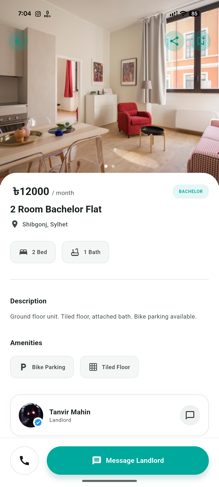
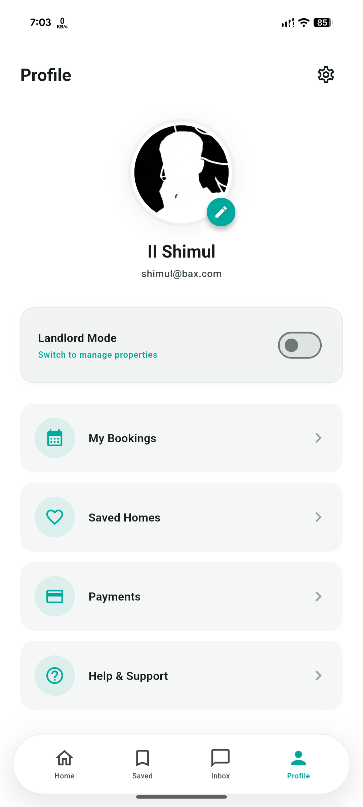
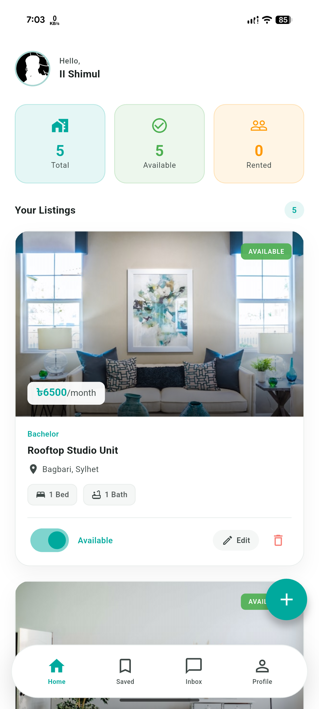
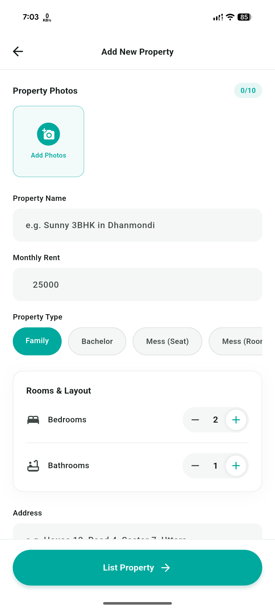

# BashaKhojo

BashaKhojo is a modern, feature-rich Flutter application designed to help users find and manage rental properties with ease. Built with a clean architecture and leveraging Supabase for backend services, BashaKhojo offers a seamless experience for both property seekers and owners.

<p align="center">
	
</p>

---

## 🚀 Features

- 🔐 **Authentication**: Secure login and registration powered by Supabase.
- 🏠 **Property Listings**: Browse, search, and filter rental properties.
- 💬 **Inbox & Messaging**: Communicate directly with property owners or seekers.
- ❤️ **Saved Properties**: Bookmark your favorite listings for quick access.
- 👤 **User Profiles**: Manage your personal information and preferences.
- 🎨 **Beautiful UI**: Modern, responsive, and intuitive design.

## 📱 Screenshots

<p align="center">
	
	
	
	
	
	
	
	
	
</p>

## 🛠️ Tech Stack

- **Flutter**: UI toolkit for building natively compiled applications.
- **Supabase**: Backend-as-a-Service for authentication and database.
- **Dart**: Programming language for Flutter.

## 📂 Project Structure

```
lib/
	main.dart                # App entry point
	core/                    # Core app logic and main shell
	screens/                 # UI screens (auth, home, inbox, etc.)
	services/                # Supabase and other services
	common/                  # Shared components, widgets, and utils
assets/                    # Images, logos, and other assets
```

## 🚦 Getting Started

1. **Clone the repository:**
   ```bash
   git clone https://github.com/ii-shimul/bashakhojo.git
   cd bashakhojo
   ```
2. **Install dependencies:**
   ```bash
   flutter pub get
   ```
3. **Configure Supabase:**
   - Update your Supabase credentials in `lib/services/supabase_service.dart` by creating a .env file in the root folder.
4. **Run the app:**
   ```bash
   flutter run
   ```

## 🤝 Contributing

Contributions are welcome! Please open issues and submit pull requests for new features, bug fixes, or improvements.

---

<p align="center">
	<b>BashaKhojo</b> &mdash; Find your next home, effortlessly.
</p>
